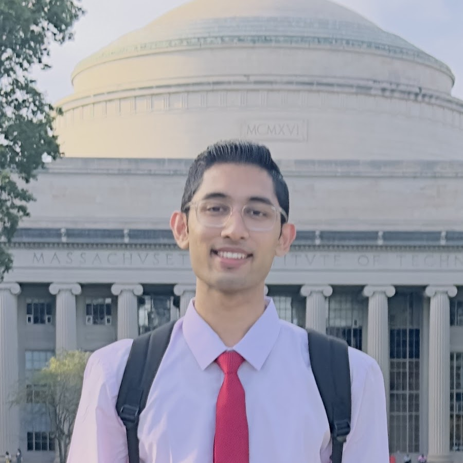

# PyTexas Meetup

{align=right}

The PyTexas Meetup is a virtual meetup, held in Discord, that aims to 
connect the Python developers within the great state
of Texas and beyond. 

[Join the Discord :fontawesome-brands-discord:](https://discord.gg/jNPAbcNukj){ .md-button .md-button--primary}
[Speak at the PyTexas Meetup :fontawesome-solid-person-chalkboard:](https://forms.gle/u2HwuZGmPBj9n9bQ6){ .md-button .md-button--primary}

## Upcoming PyTexas Meetups

### February Meetup - February 3, 2026

**LLM-powered Merge Conflict Resolution** - Advitya Gemawat

Merge Conflicts in software programming occur in 20% of all merges in open-source projects, incurring a median resolution time of ~6 minutes for a single conflict at best, or multiple days at worst. This talk will touch upon LLM Evaluations, Azure OpenAI Fine-Tuning, AI-generated resolution explanations, and usage of multiple Python SDKs to craft a scalable LLM-powered Merge Conflict Resolver. Our results indicate up to 125% performance improvement over vanilla LLM resolution accuracy.

[RSVP Here :fontawesome-solid-ticket:](https://discord.com/events/1012382914035597372/PLACEHOLDER){ .md-button .md-button--primary }

{: style="height:150px;width:150px" align=left}

_Advitya is an ML Engineer at Microsoft, specializing in scalable machine learning systems and Responsible AI (RAI). He has authored publications, holds patents, and received awards from leading venues such as VLDB, ACM SIGMOD, and CIDR. At Microsoft, Advitya has worked with Azure Edge & Platform, Gray Systems Lab, and Windows, building ML and LLM services to enhance developer productivity. He also developed Azure ML's RAI tooling for computer vision models and Azure OpenAI Evaluations, released at Microsoft Build (2023-2025). He was a technical reviewer of the Amazon bestseller 'Ace the Data Science Interview' and was recognized as a "25 under 25: Top Data Science Contributor & Thought Leader."_

