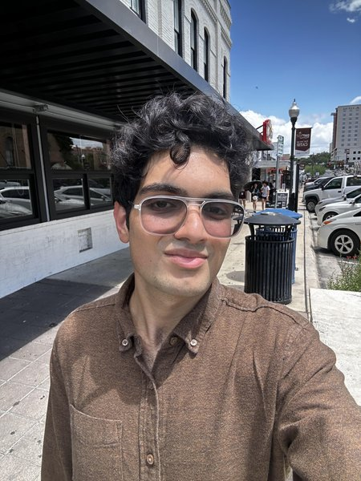

# PyTexas Meetup

{align=right}

The PyTexas Meetup is a virtual meetup, held in Discord, that aims to 
connect the Python developers within the great state
of Texas and beyond. 

[Join the Discord :fontawesome-brands-discord:](https://discord.gg/jNPAbcNukj){ .md-button .md-button--primary}
[Speak at the PyTexas Meetup :fontawesome-solid-person-chalkboard:](https://forms.gle/u2HwuZGmPBj9n9bQ6){ .md-button .md-button--primary}

## Upcoming PyTexas Meetups

### August Meetup - August 4, 2026

**How to Read the AI Brain** - Shayan Ali

Artificial neural networks over the course of the last 5 to 6 years have grown so large and complex that humans are losing the ability to understand and interpret this artificial brain. If this continues, our society can face disastrous consequences. This talk sheds light on how these networks work and, drawing from Shayan's personal research, how we can develop that understanding for the future ahead.

[RSVP Here :fontawesome-solid-ticket:](https://pytexas.org/meetup/join){ .md-button .md-button--primary }

{: style="height:150px;width:150px" align=left}

_Shayan is a second-year Computer Science and Data Analysis student at Texas State University who is passionate about the AI space, wants to make a real impact in the world in terms of AI safety, and is currently working on integrating AI into workflows at his university._

