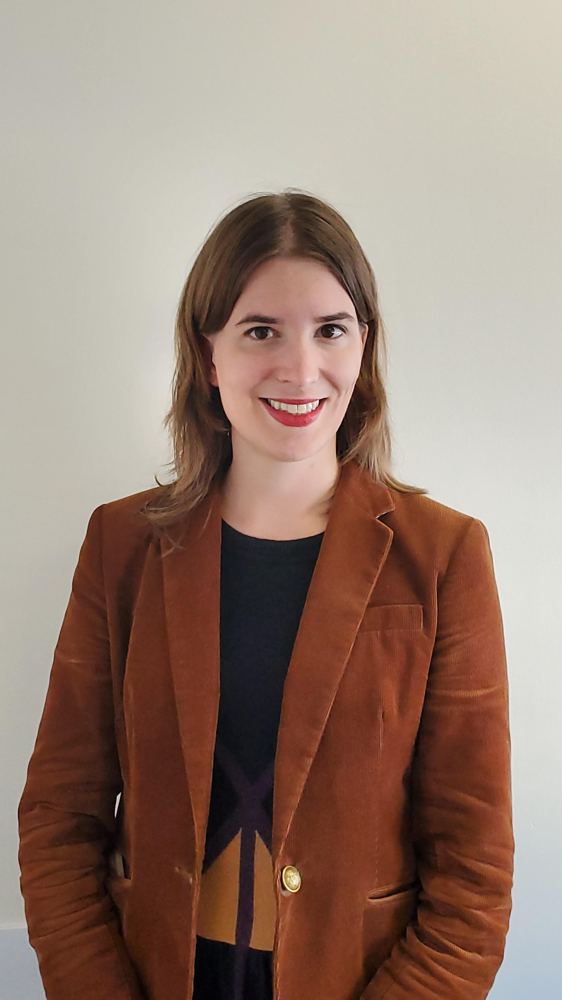

# August 2024 Meetup

Marissa talked to us about what playwrighting and Python script writing have in common.

<!-- more -->
{: style="height:25%;width:25%" align=left}

#### Two Kinds of Scripting: What Writing Plays Has Taught Me About Writing Python Programs - Marissa Skudlarek

> It’s a set of instructions, describing a series of actions to be taken or events that should happen. It’s written with specialized syntax and formatting. You want it to be efficient; you don’t want it to bog down. It doesn’t reach its full potential until you run through it, start to finish, without error.
> 
> Am I talking about a play script, or a Python program?
> 
> "Two Kinds of Scripting" explores the surprising and thought-provoking connections between writing code and writing plays, from the perspective of a Bay Area software engineer with a degree in drama from a liberal arts college and two decades of playwriting experience. It will discuss how structuring and plotting a play is like structuring a computer program; the way that a knowledge of Method Acting can help you figure out to name your Python methods; and how stage directions are just as controversial among theater folks as code comments are among engineers. Finally, the talk will discuss some things that playwrights could learn from the engineering world, including version control and better feedback/""debugging"" techniques.

*Marissa Skudlarek is a Senior Software Engineer at Lex Machina and an accomplished playwright and translator. Her first play, Deus ex Machina, won a national teen playwriting contest in 2006, and since then, her plays have been staged or workshopped around the Bay Area and beyond. She is a longtime associate of the San Francisco Olympians Festival and a former member of the PlayGround SF Writers Pool. Marissa has a degree in Drama and French from Vassar College, and learned software engineering at the Hackbright bootcamp. Her Hackbright final project, a website to help writers of historical fiction determine whether they are using period-accurate vocabulary, went viral on Twitter in Spring 2019 and can still be accessed at Wordsworth.us. She lives in San Francisco, California.*