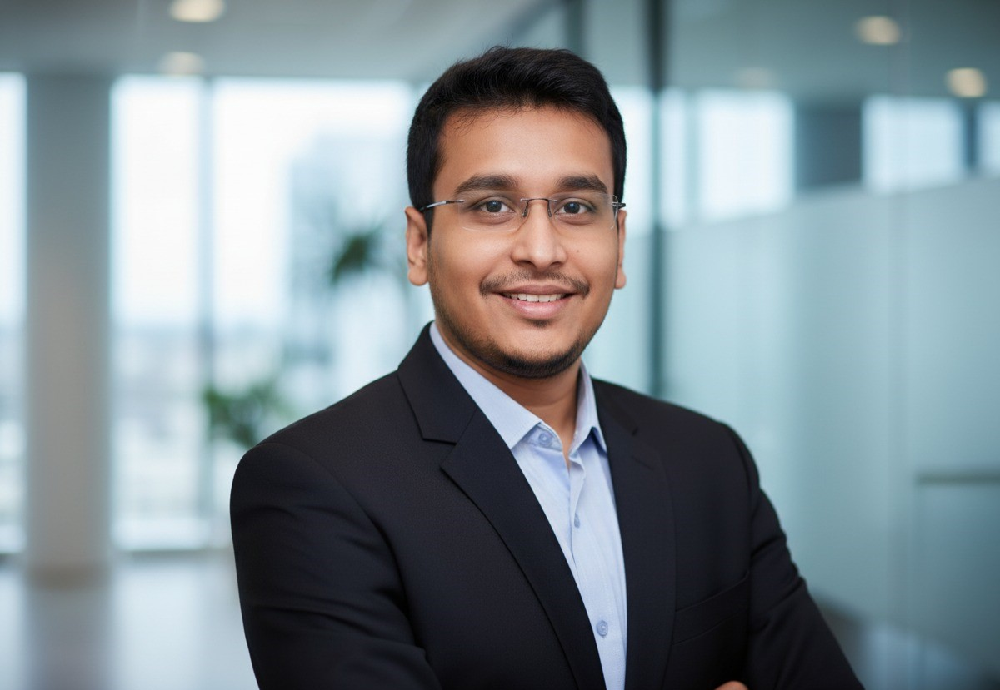

# March 2026 Meetup

In an era where enterprises generate massive, complex streams of unstructured data from documents and logs to images, audio, and video, traditional search and analytics fall short. This session explores a transformative, production-ready framework for Multimodal Retrieval-Augmented Generation (RAG), designed to redefine how organizations unlock insights from every data modality. Discover how an intelligent agent, built using cutting-edge encoders and composable AI models, empowers organizations to understand, retrieve, and reason over diverse information in real time.

<!-- more -->

{: style="height:150px;width:150px" align=left}

*Dippu is a strategic Data & Analytics leader and thought leader in emerging solutions, including Computer Vision and Generative AI/LLMs. Dippu has deep expertise in multi-cloud platforms, Big Data frameworks and Enterprise architecture. He possesses extensive experience in designing, implementing comprehensive Data & Analytics solutions from ingestion and ETL to advanced analytics and presentation across multiple domains. His technical prowess is underscored by certifications like Azure Solution Architect, Databricks Engineer Expert, and Palantir Foundry Expert. Furthermore, he is a key global member of the AI Ethics & Compliance Assessment team, and consistently translates cutting-edge technology into tangible business value for C-level executives.*
