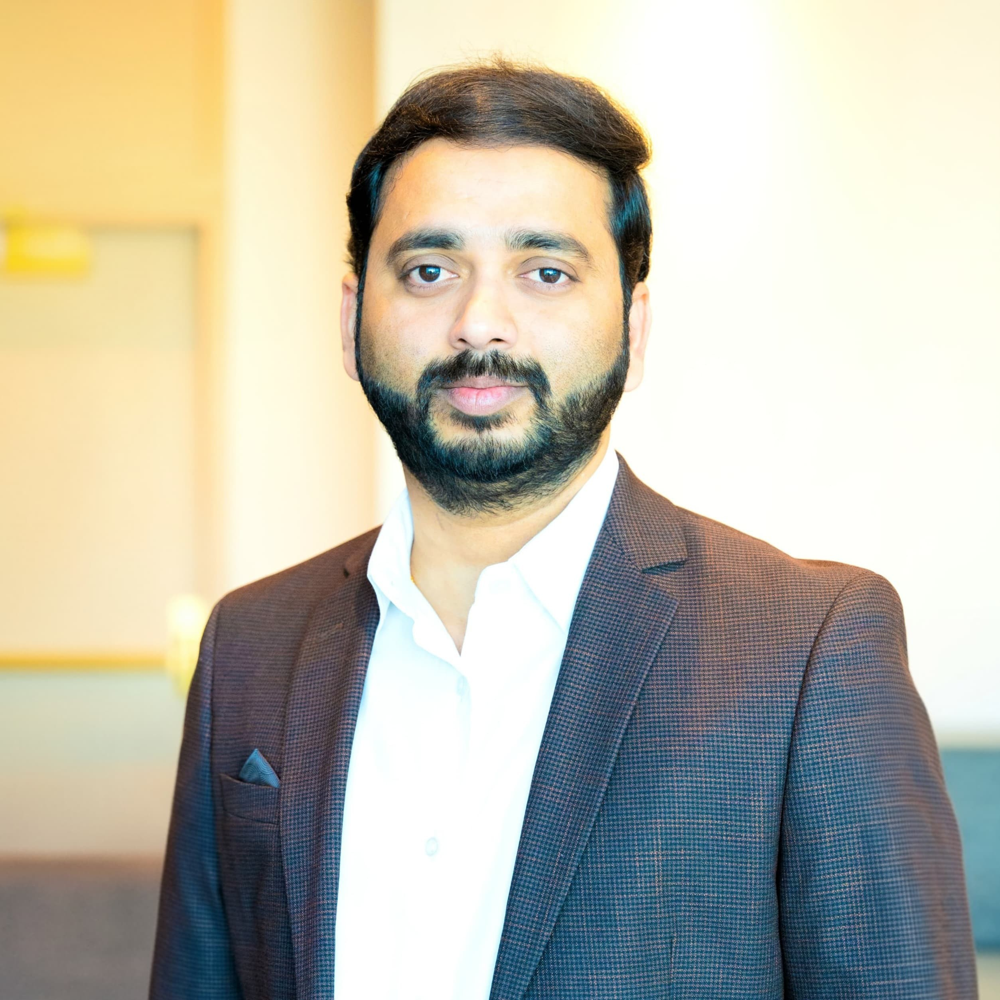

# September 2026 Meetup

Architecture diagrams can explain what a system looks like, but they rarely explain how teams should evolve it safely. Python systems often grow through rapid iteration, integration needs, and team-specific decisions, and over time the challenge becomes less about drawing the right diagram and more about creating governance that helps people make better changes. This talk reframes software architecture as a living decision system, built around decision records, ownership boundaries, integration contracts, stakeholder alignment, and change readiness.

<!-- more -->

{: style="height:150px;width:150px" align=left}

*Nishanth Sirikonda is a Cloud Solutions Architect with over 10 years of experience designing and implementing scalable, secure, and user-focused HCM solutions. He brings deep expertise in the core areas of Artificial Intelligence/Machine Learning, Cybersecurity, and Cloud Computing. He collaborates closely with stakeholders to deliver impactful, future-ready solutions that streamline operations and elevate workforce experiences. He is an active IEEE member and technology community contributor, he is passionate about bridging human potential with machine intelligence to create future-ready, resilient organizations.*
